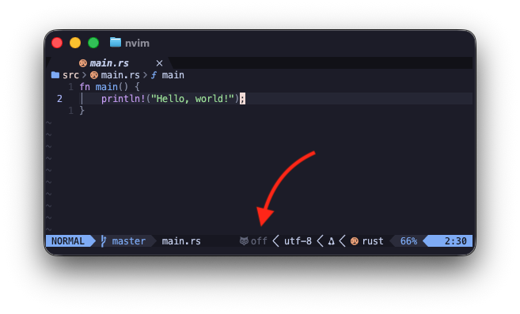

+++
date = '2026-09-02T16:10:31+07:00'
draft = false
title = 'RustOwl in Lualine'
description = 'Show the RustOwl status in your Neovim Lualine statusline, with colors and mouse toggling.'
tags = ['rust', 'vim', 'neovim']
comments = true
+++
If you don't know what RustOwl is, head over to the project repo [https://github.com/cordx56/rustowl](https://github.com/cordx56/rustowl).

We're going to show the RustOwl status in Lualine (see: [https://github.com/nvim-lualine/lualine.nvim](https://github.com/nvim-lualine/lualine.nvim)).
The reason we want this is because we might not be aware whether RustOwl is enabled or not, so showing it in Lualine gives extra awareness about the RustOwl status without having to memorize it. 

Make sure you have RustOwl properly set up on your Neovim.

The Lualine plugin setup:
```lua
{
    "nvim-lualine/lualine.nvim",
    dependencies = {
        "nvim-tree/nvim-web-devicons", -- or you can use mini.icons from mini.nvim
    },
    event = "VeryLazy",
    opts = {
    sections = {
        lualine_x = {
            {
                function()
                    local ok, rustowl = pcall(require, "rustowl")
                    if not ok then
                        return ""
                    end

                    return rustowl.is_enabled() and "RustOwl" or ""
                end,
                cond = function()
                    return vim.bo.filetype == "rust"
                end,
            },

            -- built-in components, not related to rustowl status
            "encoding",
            "fileformat",
            "filetype",
        },
    },
}
```

Above is the minimum setup that I used.

Try enable/disable RustOwl from the Neovim command line with `:Rustowl toggle` — it will show the RustOwl status in Lualine.

Alternatively, if you want to have colors and mouse interaction:
```lua
{
    "nvim-lualine/lualine.nvim",
    dependencies = {
        "nvim-tree/nvim-web-devicons", -- or you can use mini.icons from mini.nvim
    },
    event = "VeryLazy",
    opts = {
    sections = {
        lualine_x = {
            -- RustOwl status component
            {
                function()
                    local ok, rustowl = pcall(require, "rustowl")
                    if not ok then
                        return ""
                    end

                    -- you can use this if you don't have Hacker Font, use below
                    -- return rustowl.is_enabled() and "RustOwl on" or "RustOwl off" 

                    -- you need Hacker Font to render the icon (preferred)
                    return rustowl.is_enabled() and "󰏒 on" or "󰏒 off" 
                end,
                cond = function()
                    return vim.bo.filetype == "rust"
                end,
                color = function()
                    local ok, palette = pcall(function()
                        return require("catppuccin.palettes").get_palette()
                    end)
                    local green = ok and palette.green or "#a6e3a1" 
                    local dim = ok and palette.overlay0 or "#6c7086"

                    local ok_owl, rustowl = pcall(require, "rustowl")
                    if ok_owl and rustowl.is_enabled() then
                        return { fg = green }
                    end
                    return { fg = dim }
                end,
                on_click = function()
                    local ok, rustowl = pcall(require, "rustowl")
                    if ok then
                        rustowl.toggle()
                        require("lualine").refresh()
                    end
                end,
            },

            -- below is not related to rustowl status
            "encoding",
            "fileformat",
            "filetype",
        },
    },
}
```


Now you can see the RustOwl status colorized, and you can interact with it using the mouse. RustOwl shows in the Lualine status as *off*.


You can enter command `:Rustowl enable` or `:Rustowl toggle` to turn on, or click using mouse.


